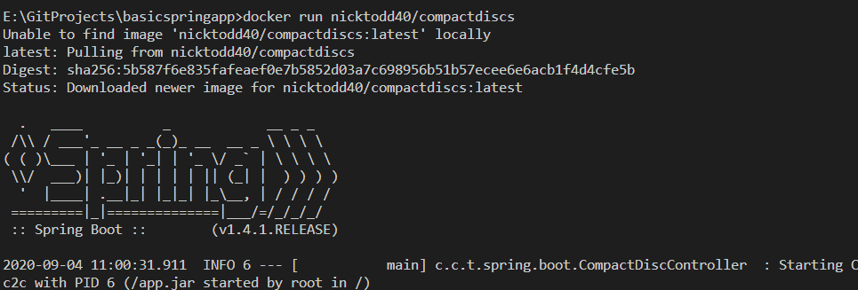
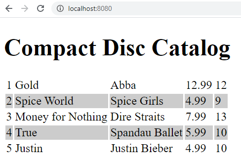

# Module 2 Working with Docker
In this first exercise, you will see how to explore artifactory and locate Docker images. We will then run an example Docker image as a container in our Virtual Machine, and finally we will explore the container lifecycle.

## Before you Begin
Any installation of Docker can be used for this exercise. If you don't have Docker installed anywhere, You can use the Docker Playground

To use the playground, open a Web browser, and visit https://labs.play-with-docker.com/ and create an account. 

Once you have a terminal available on a machine that is running Docker you can proceed.

## Part 1: Check your Docker Installation

1. To check that Docker is installed, run the following docker CLI command:

```docker --version ```

2. You wil see a version number returned. If you see Command Not Found, check that you do indeed have Docker installed!
   
## Part 2: Run a Container

Let's run up a container. We will use a  sample image from Dockerhub that contains a simple Spring Boot Application. The source code for the application we will be deploying can be found at https://github.com/nicktodd/basicspringapp. You don't need to go here since the Docker image is already in available.

3. Initially, let's run the container in the simplest way. Run the following command.

 ```docker run nicktodd40/compactdiscs ```

First, you will see the image download along with some other image layers which will be explained later. This can sometimes take a few minutes and it might seem like nothing is happening. Just be patient with your network. Once the image has downloaded, the container will launch and you will see the output to the console from Spring Boot.

An example of the kind of output you will see is shown below:



6. Once it is complete, you will notice that you have 'lost' your terminal since the docker container is now running in the foreground. To get your terminal back, use **Ctrl-C**.
    
7. What has happened to the container? Is it still running? We can find out using docker ps -a. The -a means all including stopped containers.

```docker ps -a```

8. You will see that the container has stopped. It can be turned back on, and this time it will be running in the background. Make a note of the first two digits of the container ID, and run the following command without the square brackets:

```docker start [2 digits]```

9. The response is simply the same two digits returned back. The container should be running. Verify that with docker ps again.

```docker ps```


10. Now destroy the container. This is done using rm. The container is running so we will have to add a -f flag to force it.

```docker rm -f [2 digits]```

11. You can verify its destruction using docker ps -a.

```docker ps -a```

## Part 3 Adding Routing
Although the container appears to have been running, we had no way of visiting it in the browser. Also, we lost the terminal as soon as we launched it. Let's resolve those problems now.

1. Launch a container from the image again, but this time with two attributes
   - **-d** to run it in the background (detached)
   - **-p 8080:8080** to handle the routing

 ```docker run -d -p 8080:8080 nicktodd40/compactdiscs ```

 2. Note how quick it ran, and that also it didn't download the image again. That is because you already have the image locally so it does not need to download it again.

The -p 8080:8080 is mapping the ports. the 8080 on the left is the VM (referred to as the Docker host) and the 8080 on the right is the container port, since Spring Boot applications run on port 8080.

3. You can now visit your Spring Boot application from the browser:

```http://[hostname]:8080```

For example, on a local machine, the hostname will be localhost.

You can now see the running application in your browser:



This means that you are now visiting a Docker container, running in a Docker host, via port forwarding from a browser. That is pretty cool!


4. Finally, terminate your container using docker rm -f [2 digits]. You can work out how to find the two digits (hint: use docker ps).


## Review
Congratulations. You have now successfully  downloaded and launched a docker container, and then configured the ports so it can be accessed externally. 

In the next exercise, you will see how you can work with images, creating your own images and also managing the images that you have on your local VM.

